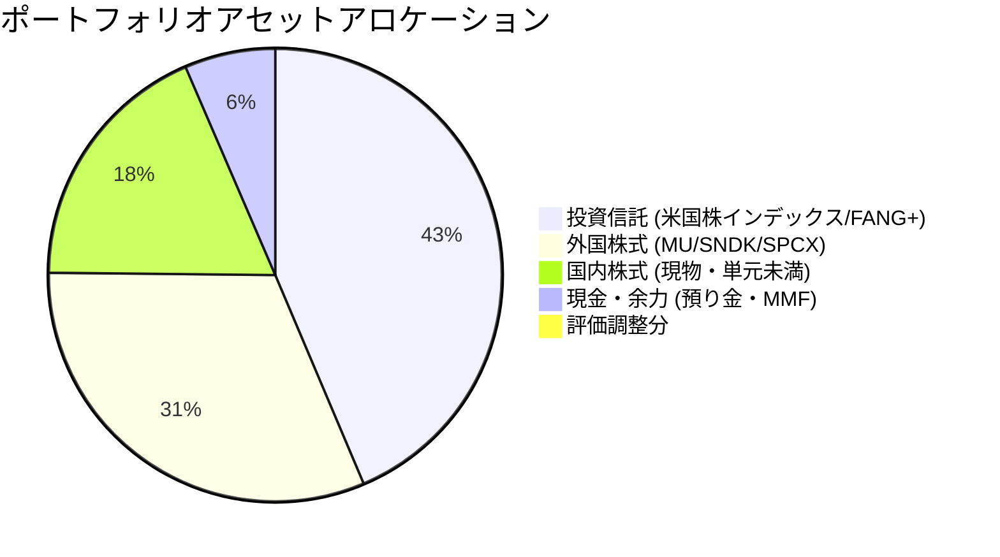

# ポートフォリオ管理・分析報告（2026-07-02基準）

**作成日**: 2026-07-02  
**使用スキル**: `portfolio-review`  
**検証価格日時**: 2026年7月1日〜2日（日本市場・米国市場最新データ反映）  

---

## 1. 結論と最近のアクション

### 1.1 SMCI（Super Micro Computer）の損切り実行
*   **判断とアクション**: 直近のガバナンスリスクおよびボラティリティ急増の分析を踏まえ、今回のリスクは「許容不可能」と判断。規律に基づき、SMCIの全ポジションの損切りを迅速に完了しました。不確実性の高いリスクを速やかに排除し、資本の安全性を最優先した重要な意思決定です。
*   **現在の全体状況**: 中国テック株などの旧ポートフォリオから完全に移行し、現在は「国内優良株（キーエンス、信越ポリマー等）」「米国半導体（MU、SNDK）」「宇宙長期オプション（SPCX）」「積立・特定インデックス（VTI、FANG+）」を中核とする、口座区分が整理された健全なポートフォリオに再構築されています。

---

## 2. 保有資産の口座区分別整理

総資産は、主要取引口座（商品評価額 5,098,000円 ＋ 預り金 353,225円）、単元未満株（かぶミニ）口座（182,854円）、およびレバレッジ投信（6,677円）を合算し、**総額 5,640,756 円** となります。

### 2.1 特定口座（課税）

| 資産区分 | 銘柄名（コード） | 保有数量 | 平均取得価額 | 現在値/基準価額 | 評価額 | 評価損益 | 備考/役割 |
| :--- | :--- | :---: | :---: | :---: | :---: | :---: | :--- |
| **国内株式** | パワーエックス | 100株 | 2,000 円 | 1,872 円 | 187,200 円 | -12,800 円 | 非上場/成長枠 |
| **国内株式** | キーエンス (6861) | 1株 | 73,710 円 | 80,260 円 | 80,260 円 | +6,550 円 | FA/超優良コア |
| **国内株式** | ファナック (6954) | 20株 | 7,370 円 | 7,321 円 | 146,420 円 | -980 円 | ロボット/世界モート |
| **国内株式** | 信越ポリマー (7970) | 100株 | 2,537 円 | 2,477 円 | 247,700 円 | -6,000 円 | 半導体容器/TOB候補 |
| **国内株式** | 任天堂 (7974) | 15株 | 7,902 円 | 7,150 円 | 107,250 円 | -11,280 円 | グローバルIP/優良キャッシュ |
| **国内株式** | 東京エレクトロン (8035) | 1株 | 69,970 円 | 74,910 円 | 74,910 円 | +4,940 円 | 半導体製造装置コア |
| **国内株式** | GX防衛テク (2866) | 5株 | — | — | 5,180 円 | — | 単元未満/防衛ETF |
| **国内株式** | ENEOS (5020) | 5株 | — | — | 6,115 円 | — | 単元未満/資源・インフラ |
| **国内株式** | 日本製鉄 (5401) | 10株 | — | — | 5,368 円 | — | 単元未満/高配当・景気敏感 |
| **国内株式** | 三菱UFJ (8306) | 2株 | — | — | 6,644 円 | — | 単元未満/大手金融 |
| **国内株式** | JAL (9201) | 45株 | — | — | 137,520 円 | — | 単元未満/航空・リオープン |
| **国内株式** | NTT (9432) | 20株 | — | — | 2,906 円 | — | 単元未満/ディフェンシブ |
| **国内株式** | ソフトバンク (9434) | 66株 | — | — | 13,794 円 | — | 単元未満/高配当・通信 |
| **外国株式** | Micron (MU) | 3株 | 1,190.86 USD | 1,092.28 USD | 523,296 円 | -76,052 円 | DRAM/短期特定枠 |
| **投資信託** | 楽天・VTI | 33,391口 | 23,511.31 円 | 45,959 円 | 80,076 円 | +39,114 円 | 米国全体インデックス |
| **投資信託** | iFreeNEXT FANG+ | 270,518口 | 70,270.10 円 | 93,161 円 | 1,961,382 円 | +481,282 円 | 米国テック集中コア |
| **投資信託** | iFreeレバレッジ FANG+ | 1,762口 | 34,052 円 | 37,896 円 | 6,677 円 | +677 円 | 戦術的レバレッジ枠 |
| **外貨MMF** | GS米ドルMMF | 60.944口 | 1.00 USD | 1.00 USD | 8,906 円 | -161 円 | 外貨キャッシュ代替 |

### 2.2 NISA口座（非課税）

| 区分/口座 | 銘柄名（コード） | 保有数量 | 平均取得価額 | 現在値 | 評価額 | 評価損益 | 備考/役割 |
| :--- | :--- | :---: | :---: | :---: | :---: | :---: | :--- |
| **つみたてNISA** | 楽天・VTI | 85,083口 | 23,511.31 円 | 45,959 円 | 391,032 円 | +190,985 円 | 長期積立中核 |
| **成長投資枠** | Micron (MU) | 5株 | 1,190.86 USD | 1,092.28 USD | 833,002 円 | +138,188 円 | 2026年末基本期限コア |
| **成長投資枠** | SanDisk (SNDK) | 1株 | 2,220.00 USD | 2,037.23 USD | 330,076 円 | -53,998 円 | 2026年末高ベータ成長枠 |
| **成長投資枠** | SPCX (SpaceX) | 3株 | 135.00 USD | 157.04 USD | 76,810 円 | +11,859 円 | 長期独占オプション |

### 2.3 一般口座（課税・単元未満株）

| 資産区分 | 銘柄名（コード） | 保有数量 | 平均取得価額 | 現在値 | 評価額 | 評価損益 | 備考/役割 |
| :--- | :--- | :---: | :---: | :---: | :---: | :---: | :--- |
| **国内株式** | サイバーエージェント (4751) | 1株 | — | — | 1,447 円 | — | 単元未満/一般管理 |
| **国内株式** | ENEOS (5020) | 1株 | — | — | 1,223 円 | — | 単元未満/一般管理 |
| **国内株式** | りそなHD (8308) | 1株 | — | — | 2,198 円 | — | 単元未満/一般管理 |
| **国内株式** | 東電力HD (9501) | 1株 | — | — | 460 円 | — | 単元未満/一般管理 |

### 2.4 現金等・評価調整

| 区分 | 内訳 | 金額 | 割合 | 備考 |
| :--- | :--- | :---: | :---: | :--- |
| **預り金** | 日本円預り金等 | 353,225 円 | 6.3% | 機動余力（目標200万円以上維持） |
| **為替・評価調整** | 評価端数/外貨調整分 | 49,680 円 | 0.9% | 端数・為替換算基準の差異調整 |

---

## 3. アセットアロケーション状況

総資産額：**5,640,756 円** に対する比率構成は以下の通りです。

*   **投資信託 (43.2%)**: 米国テック中核（FANG+特定）と米国全体（VTIつみたてNISA/特定）がポートフォリオ最大の構成要素であり、長期的な株主価値への再投資エンジンとなっています。
*   **外国株式 (31.3%)**: Micron、SanDiskといったメモリ枠が中心。これらは2026年末を基本期限とする「期限付き投資」です。
*   **国内株式 (18.2%)**: キーエンス、ファナック、信越ポリマー、任天堂など、グローバルモートを持つ超優良企業へ集中配置。単元未満株（かぶミニ）口座では高配当・インフラ・金融などへ少量分散。
*   **現金・流動性 (6.4%)**: 円預り金および米ドルMMF。機動的な信用担保や暴落時用の余力として維持。

---

## 4. ポートフォリオ分析とリスク点検

### 4.1 SMCI損切り後のメモリ・半導体リスク管理
*   **評価**: SMCIというボラティリティおよび個別リスクが極めて高い銘柄を損切りしたことで、ポートフォリオ全体のダウンサイドリスクは大幅に低減しました。
*   **残る半導体要因**: Micron（特定3株、NISA5株）とSanDisk（NISA1株）のメモリ枠が合計約116万円（全体の約20%）を占めています。
*   **アクションプラン**: 以前の合意通り、MU（特定口座）については「最も早い主要DRAMイベントのT-5から決済開始、T-3完了、T-2最終期限」の規律を厳格に適用します。NISA成長投資枠のMUおよびSNDKも「2026年末」のエグジット方針を維持します。

### 4.2 口座区分の整理と税務上の考慮点
*   **一般口座の銘柄（サイバーエージェント、ENEOS 1株、りそなHD 1株、東電力HD 1株）**:
    これらは一般口座で管理されているため、確定申告時の計算が特定口座に比べて煩雑になります。評価額の合計額は極めて少額（約5,300円）であるため、税務管理の簡素化を優先し、特定口座への買い直し、または好機での売却整理を中長期的に検討する余地があります。
*   **つみたてNISA / 成長投資枠の最大化**:
    楽天VTIやMU、SNDK、SPCXのNISA枠は非課税メリットを最大化しているため、方針通りの長期・期限付き保有を継続します。

---

## 5. 次回確認時期と重点項目

*   **月次・イベントレビュー**: 
    1.  MU（特定口座3株）の決済トリガーイベントの日程確認と実行。
    2.  一般口座で保有している単元未満株の処遇（売却または特定口座での再保有）。
    3.  預り金（現金）の推移（目標：機動余力200万円の確保・維持）。
