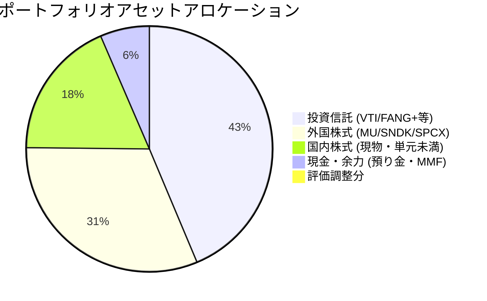

# ポートフォリオ管理・分析報告（2026-07-02基準）

**作成日**: 2026-07-02  
**使用スキル**: `portfolio-review`  
**検証価格日時**: 2026年7月1日〜2日（日本市場・米国市場最新データ反映）  

---

## 1. 結論と最近のアクション

### 1.1 SMCI（Super Micro Computer）の損切り実行
*   **判断とアクション**: 直近のガバナンスリスクおよびボラティリティ急増の分析を踏まえ、今回のリスクは「許容不可能」と判断。規律に基づき、SMCIの全ポジションの損切りを迅速に完了しました。不確実性の高いリスクを速やかに排除し、資本の安全性を最優先した重要な意思決定です。

### 1.2 複数口座の集約と端株整理のロードマップ
*   **現状**: 現在、資産は4つの証券口座（楽天証券、大和コネクト証券、マネックス証券、SBI証券）に分散しています。また、特定・一般口座の混在や、1株保有（端株）が多数存在し、管理コストおよび確定申告時の税務コストが高くなっています。
*   **整理方針**: 
    1.  **一般口座の解消**: 確定申告の負担を完全に排除するため、一般口座の銘柄（サイバーエージェント、ENEOS 1株、りそなHD、東電力HD）は例外なくCONNECTで全売却します。
    2.  **CONNECTタイムセール条件の維持**: 2026年7月22日に開催予定の「ひな株USA 7%ポイント還元タイムセール」の参加条件（7月21日時点で国内株式1万円以上保有）を満たすため、CONNECT内で**特定口座のソフトバンクのみを残し、その他は売却**します。

### 1.3 【新規方針】来年以降のNISA口座の松井証券への移管計画
*   **戦略方針**: 2027年（来年）以降、積立・投資の主軸となるNISA口座を現在の楽天証券から**松井証券へ移管**します。
*   **移管理由**: 松井証券が提供する「投信残高ポイントサービス（保有残高に応じた還元制度）」が、他社と比較して非常に優秀であり、長期的なつみたてNISAの運用において、実質的な信託報酬コストを極限まで低減して運用効率を最大化できるためです。

---

## 2. 証券口座別・口座区分別の資産明細

総資産は、主要取引口座（商品評価額 5,098,000円 ＋ 預り金 353,225円）、CONNECT口座（単元未満株182,854円 ＋ レバ投信6,677円）、マネックス口座（1,285円）、SBI口座（745円）を合算し、**総額 5,642,786 円** となります。

### 2.1 楽天証券（メイン口座：将来的なNISA移管元）
*   **資産合計**: **5,451,225 円**（保有商品評価額: 5,098,000 円 / 預り金: 353,225 円）

| 口座区分 | 銘柄名（コード） | 保有数量 | 平均取得価額 | 現在値/基準価額 | 評価額 | 評価損益 | 備考/役割 |
| :--- | :--- | :---: | :---: | :---: | :---: | :---: | :--- |
| **特定** | パワーエックス | 100株 | 2,000 円 | 1,872 円 | 187,200 円 | -12,800 円 | 非上場/成長枠 |
| **特定** | キーエンス (6861) | 1株 | 73,710 円 | 80,260 円 | 80,260 円 | +6,550 円 | FA/超優良コア |
| **特定** | ファナック (6954) | 20株 | 7,370 円 | 7,321 円 | 146,420 円 | -980 円 | ロボット/世界モート |
| **特定** | 信越ポリマー (7970) | 100株 | 2,537 円 | 2,477 円 | 247,700 円 | -6,000 円 | 半導体容器/TOB候補 |
| **特定** | 任天堂 (7974) | 15株 | 7,902 円 | 7,150 円 | 107,250 円 | -11,280 円 | グローバルIP/優良キャッシュ |
| **特定** | 東京エレクトロン (8035) | 1株 | 69,970 円 | 74,910 円 | 74,910 円 | +4,940 円 | 半導体製造装置コア |
| **特定** | Micron (MU) | 3株 | 1,190.86 USD | 1,092.28 USD | 523,296 円 | -76,052 円 | DRAM/短期特定枠 |
| **特定** | 楽天・VTI | 33,391口 | 23,511.31 円 | 45,959 円 | 80,076 円 | +39,114 円 | 米国全体インデックス |
| **特定** | iFreeNEXT FANG+ | 270,518口 | 70,270.10 円 | 93,161 円 | 1,961,382 円 | +481,282 円 | 米国テック集中コア |
| **特定** | GS米ドルMMF | 60.944口 | 1.00 USD | 1.00 USD | 8,906 円 | -161 円 | 外貨キャッシュ代替 |
| **つみたてNISA** | 楽天・VTI | 85,083口 | 23,511.31 円 | 45,959 円 | 391,032 円 | +190,985 円 | 長期積立中核（楽天で維持） |
| **成長投資枠** | Micron (MU) | 5株 | 1,190.86 USD | 1,092.28 USD | 833,002 円 | +138,188 円 | 2026年末基本期限コア |
| **成长投資枠** | SanDisk (SNDK) | 1株 | 2,220.00 USD | 2,037.23 USD | 330,076 円 | -53,998 円 | 2026年末高ベータ成長枠 |
| **成長投資枠** | SPCX (SpaceX) | 3株 | 135.00 USD | 157.04 USD | 76,810 円 | +11,859 円 | 長期独占オプション |

### 2.2 大和コネクト証券（CONNECT）
*   **資産合計**: **189,531 円**（国内株式: 182,854 円 / 投資信託: 6,677 円）

| 口座区分 | 銘柄名（コード） | 保有数量 | 評価額 | 優待/番号維持の必要性 | 整理・維持方針 |
| :--- | :--- | :---: | :---: | :--- | :--- |
| **特定** | ソフトバンク (9434) | 66株 | 13,794 円 | なし | **キープ（1万円維持条件）** ※タイムセール参加要件（1万円以上）をクリア。 |
| **特定** | GX防衛テク (2866) | 5株 | 5,180 円 | なし | **売却** |
| **特定** | ENEOS (5020) | 5株 | 6,115 円 | なし | **売却** |
| **特定** | 日本製鉄 (5401) | 10株 | 5,368 円 | なし | **売却** |
| **特定** | 三菱UFJ (8306) | 2株 | 6,644 円 | なし | **売却** |
| **特定** | JAL (9201) | 45株 | 137,520 円 | なし | **売却**（キャッシュ回収を最優先） |
| **特定** | NTT (9432) | 20株 | 2,906 円 | なし | **売却** |
| **特定** | iFreeレバレッジ FANG+ | 1,762口 | 6,677 円 | なし | **売却** |
| **一般** | サイバーエージェント (4751)| 1株 | 1,447 円 | なし | **売却**（一般口座解消優先） |
| **一般** | ENEOS (5020) | 1株 | 1,223 円 | なし | **売却**（一般口座解消優先） |
| **一般** | りそなHD (8308) | 1株 | 2,198 円 | なし | **売却** |
| **一般** | 東電力HD (9501) | 1株 | 460 円 | なし | **売却** |

### 2.3 マネックス証券
*   **資産合計**: **1,285 円**（国内株式: 678 円 / 投資信託: 602 円 / 預り金: 5 円）

| 口座区分 | 銘柄名（コード） | 保有数量 | 評価額 | 優待/番号維持の必要性 | 整理方針 |
| :--- | :--- | :---: | :---: | :--- | :--- |
| **特定** | マネックスグループ (8698) | 1株 | 678 円 | **あり**（1株でBTC付与の優待） | **キープ推奨**（優待獲得用1株保有） |
| **特定** | iFreeNEXT FANG+ | 83口 | 602 円 | なし | **売却** |

### 2.4 SBI証券
*   **資産合計**: **745 円**

| 口座区分 | 銘柄名（コード） | 保有数量 | 評価額 | 優待/番号維持の必要性 | 整理方針 |
| :--- | :--- | :---: | :---: | :--- | :--- |
| **特定** | 楽天グループ (4755) | 1株 | 745 円 | なし | **売却** |

---

## 3. アセットアロケーション状況（全体合算）

総資産額：**5,642,786 円** に対する比率構成は以下の通りです。

---

## 4. 意思決定の判定材料と分析

### 4.1 CONNECTタイムセール対応と端株の断捨離
*   **推奨案**: **ソフトバンク (9434) のみを特定口座で維持**し、それ以外の端株はすべてCONNECTで直接売却。
*   **手数料**: 松井証券への移管はコスト（1銘柄3,300円）および手数料自由度の面で極めて不利なため、CONNECTで直接売却する（スプレッド0.5%）のが最善です。
*   **一般口座**: 二度手間の確定申告コストを避けるため、CONNECTの一般口座銘柄は最優先で売却します。

### 4.2 NISA口座の松井証券への移管と移行ステップ
NISA口座を楽天証券から松井証券へ来年以降移管するにあたり、税制度および運用実務上のロードマップを整理します。

#### ① 現行保有商品（楽天NISA）の取り扱い方針
*   **制度の制約**: NISA口座を他社に移管する場合、**現在NISA口座で保有している商品（楽天VTI、MU、SNDK、SPCX）をそのまま松井証券のNISA口座へ直接移管（ロールオーバー）することは制度上できません**。
*   **実行案**: 
    1.  現在楽天証券のNISA口座で保有している商品は、楽天証券で**非課税期間終了までそのまま維持し、期限付きで運用（または計画的に売却エグジット）**します。
    2.  来年以降の「新規の非課税枠（つみたて投資枠・成長投資枠）」については、松井証券側で口座を開設・実行し、投信残高ポイントの恩恵を最大化します。

#### ② 松井証券移管後の積立・レバレッジ戦略
*   **投信残高還元のメリット**: 松井証券では投資信託の保有残高に対してポイントが還元されるため、低コストのインデックス投信（楽天VTIまたは代替のeMAXIS Slimシリーズ等）のつみたて口座として非常に優秀です。
*   **レバレッジ強化の注意点**: 
    *   投信残高還元を狙い、松井証券の特定口座でレバレッジ型投信（レバFANG+など）を大きく買う方針を検討する場合も、信託報酬自体が高いためポイント還元の恩恵以上に運用コストが大きくなります。高成長期待のコア部分（FANG+等）は極力、非課税であるNISA枠の現物で運用すべきです。
    *   半導体等のボラティリティの高い資産へのレバレッジは、ロスカットリスクを避けるため、現行NISAでの現物保有（MU、SNDKなど）を優先させるのがリスク調整後リターンの面から適切です。

---

## 5. 次回確認時期と重点項目

*   **短期アクション（今週中）**:
    1.  大和コネクト証券（CONNECT）内の不要な端株の全売却注文（ソフトバンクのみ残す）。
    2.  回収した現金を楽天証券へ送金・集約。
    3.  マネックス証券のFANG+、SBI証券の楽天グループの売却・整理。
*   **中長期アクション（来年に向けた準備）**:
    1.  松井証券へのNISA口座変更の手続き（通常、毎年9月中旬〜10月頃に翌年分の勘定変更手続きが開始されます）。
    2.  楽天証券内の現行NISA保有商品のエグジット管理（MU/SNDKの2026年末基本期限ルール）。
