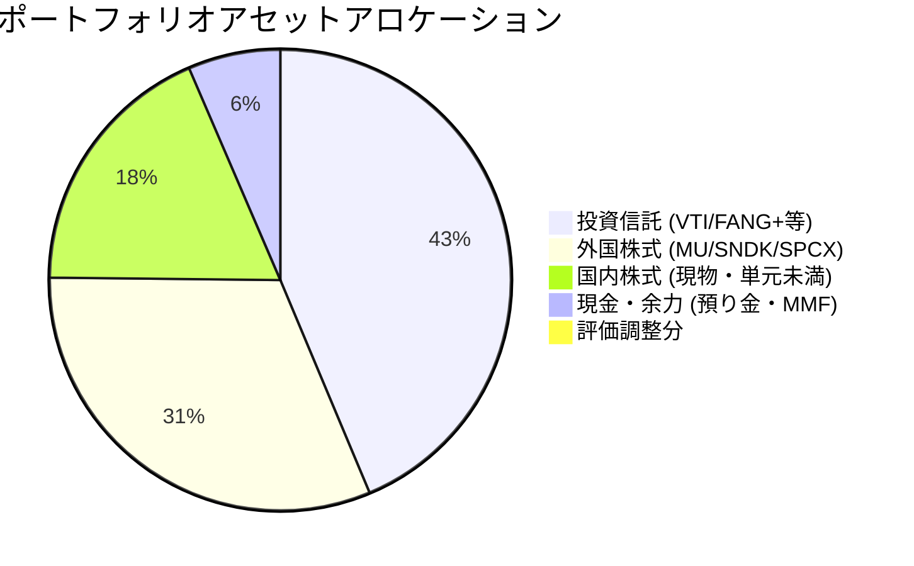

# ポートフォリオ管理・分析報告（2026-07-02基準）

**作成日**: 2026-07-02  
**使用スキル**: `portfolio-review`  
**検証価格日時**: 2026年7月1日〜2日（日本市場・米国市場最新データ反映）  

---

## 1. 結論と最近のアクション

### 1.1 SMCI（Super Micro Computer）の損切り実行
*   **判断とアクション**: 直近のガバナンスリスクおよびボラティリティ急増の分析を踏まえ、今回のリスクは「許容不可能」と判断。規律に基づき、SMCIの全ポジションの損切りを迅速に完了しました。不確実性の高いリスクを速やかに排除し、資本の安全性を最優先した重要な意思決定です。

### 1.2 複数口座の集約と端株整理のロードマップ
*   **現状**: 現在、資産は4つの証券口座（楽天証券、大和コネクト証券、マネックス証券、SBI証券）に分散しています。また、特定・一般口座の混在や、1株保有（端株）が多数存在し、管理コストおよび確定申告時の税務コストが高くなっています。
*   **整理方針**: 株主優待などの明確な「1株キープ価値」がない銘柄は、CONNECTの売却スプレッドを考慮しても、税務管理の簡素化および資金集約のために速やかに売却整理することを推奨します。

---

## 2. 証券口座別・口座区分別の資産明細

総資産は、主要取引口座（商品評価額 5,098,000円 ＋ 預り金 353,225円）、CONNECT口座（単元未満株182,854円 ＋ レバ投信6,677円）、マネックス口座（1,285円）、SBI口座（745円）を合算し、**総額 5,642,786 円** となります。

### 2.1 楽天証券（メイン口座）
*   **資産合計**: **5,451,225 円**（保有商品評価額: 5,098,000 円 / 預り金: 353,225 円）

| 口座区分 | 銘柄名（コード） | 保有数量 | 平均取得価額 | 現在値/基準価額 | 評価額 | 評価損益 | 備考/役割 |
| :--- | :--- | :---: | :---: | :---: | :---: | :---: | :--- |
| **特定** | パワーエックス | 100株 | 2,000 円 | 1,872 円 | 187,200 円 | -12,800 円 | 非上場/成長枠 |
| **特定** | キーエンス (6861) | 1株 | 73,710 円 | 80,260 円 | 80,260 円 | +6,550 円 | FA/超優良コア |
| **特定** | ファナック (6954) | 20株 | 7,370 円 | 7,321 円 | 146,420 円 | -980 円 | ロボット/世界モート |
| **特定** | 信越ポリマー (7970) | 100株 | 2,537 円 | 2,477 円 | 247,700 円 | -6,000 円 | 半導体容器/TOB候補 |
| **特定** | 任天堂 (7974) | 15株 | 7,902 円 | 7,150 円 | 107,250 円 | -11,280 円 | グローバルIP/優良キャッシュ |
| **特定** | 東京エレクトロン (8035) | 1株 | 69,970 円 | 74,910 円 | 74,910 円 | +4,940 円 | 半導体製造装置コア |
| **特定** | Micron (MU) | 3株 | 1,190.86 USD | 1,092.28 USD | 523,296 円 | -76,052 円 | DRAM/短期特定枠 |
| **特定** | 楽天・VTI | 33,391口 | 23,511.31 円 | 45,959 円 | 80,076 円 | +39,114 円 | 米国全体インデックス |
| **特定** | iFreeNEXT FANG+ | 270,518口 | 70,270.10 円 | 93,161 円 | 1,961,382 円 | +481,282 円 | 米国テック集中コア |
| **特定** | GS米ドルMMF | 60.944口 | 1.00 USD | 1.00 USD | 8,906 円 | -161 円 | 外貨キャッシュ代替 |
| **つみたてNISA** | 楽天・VTI | 85,083口 | 23,511.31 円 | 45,959 円 | 391,032 円 | +190,985 円 | 長期積立中核 |
| **成長投資枠** | Micron (MU) | 5株 | 1,190.86 USD | 1,092.28 USD | 833,002 円 | +138,188 円 | 2026年末基本期限コア |
| **成長投資枠** | SanDisk (SNDK) | 1株 | 2,220.00 USD | 2,037.23 USD | 330,076 円 | -53,998 円 | 2026年末高ベータ成長枠 |
| **成長投資枠** | SPCX (SpaceX) | 3株 | 135.00 USD | 157.04 USD | 76,810 円 | +11,859 円 | 長期独占オプション |

### 2.2 大和コネクト証券（CONNECT）
*   **資産合計**: **189,531 円**（国内株式: 182,854 円 / 投資信託: 6,677 円）

| 口座区分 | 銘柄名（コード） | 保有数量 | 評価額 | 優待/番号維持の必要性 | 整理方針 |
| :--- | :--- | :---: | :---: | :--- | :--- |
| **特定** | GX防衛テク (2866) | 5株 | 5,180 円 | なし | **売却**（楽天へキャッシュ集約） |
| **特定** | ENEOS (5020) | 5株 | 6,115 円 | なし（優待は100株以上） | **売却** |
| **特定** | 日本製鉄 (5401) | 10株 | 5,368 円 | なし（見学会等は抽選・不要） | **売却** |
| **特定** | 三菱UFJ (8306) | 2株 | 6,644 円 | なし | **売却** |
| **特定** | JAL (9201) | 45株 | 137,520 円 | なし（割引券は100株以上） | **売却**（評価額が大きいため優先整理） |
| **特定** | NTT (9432) | 20株 | 2,906 円 | なし（dポイントは100株以上） | **売却** |
| **特定** | ソフトバンク (9434) | 66株 | 13,794 円 | なし（PayPayポイントは100株以上）| **売却** |
| **特定** | iFreeレバレッジ FANG+ | 1,762口 | 6,677 円 | なし | **売却**（楽天証券にFANG+集約済） |
| **一般** | サイバーエージェント (4751)| 1株 | 1,447 円 | なし（ABEMA優待は100株以上） | **売却**（一般口座解消優先） |
| **一般** | ENEOS (5020) | 1株 | 1,223 円 | なし | **売却**（一般口座解消優先） |
| **一般** | りそなHD (8308) | 1株 | 2,198 円 | なし | **売却**（一般口座解消優先） |
| **一般** | 東電力HD (9501) | 1株 | 460 円 | なし | **売却**（一般口座解消優先） |

### 2.3 マネックス証券
*   **資産合計**: **1,285 円**（国内株式: 678 円 / 投資信託: 602 円 / 預り金: 5 円）

| 口座区分 | 銘柄名（コード） | 保有数量 | 評価額 | 優待/番号維持の必要性 | 整理方針 |
| :--- | :--- | :---: | :---: | :--- | :--- |
| **特定** | マネックスグループ (8698) | 1株 | 678 円 | **あり**（1株で暗号資産/BTC付与） | **キープ推奨**（優待利回り極高） |
| **特定** | iFreeNEXT FANG+ | 83口 | 602 円 | なし | **売却**（または放置、小額すぎるため） |

### 2.4 SBI証券
*   **資産合計**: **745 円**

| 口座区分 | 銘柄名（コード） | 保有数量 | 評価額 | 優待/番号維持の必要性 | 整理方針 |
| :--- | :--- | :---: | :---: | :--- | :--- |
| **特定** | 楽天グループ (4755) | 1株 | 745 円 | なし（SIM無料等は100株以上） | **売却**（または放置） |

---

## 3. アセットアロケーション状況（全体合算）

総資産額：**5,642,786 円** に対する比率構成は以下の通りです。

*   **投資信託 (43.3%)**: 米国テック集中コア（FANG+）と全米インデックス（VTI）がエンジン。
*   **外国株式 (31.2%)**: 半導体メモリ（MU、SNDK）およびSpaceXの現物。
*   **国内株式 (18.2%)**: キーエンス、ファナック、信越ポリマーなど主力現物。CONNECT等の端株が整理されれば、さらに比率が主力株へ集中し効率化されます。
*   **現金・流動性 (6.4%)**: 信用取引の保証金や暴落時買い増し用の余力。

---

## 4. 意思決定の判定材料と分析

### 4.1 端株整理（CONNECT・マネックス・SBI）の判定

ユーザーから提示された判定材料に基づき、端株を評価します。

#### ① 株主番号の維持・長期優待目的での1株保有の要否
*   **判定結果**: **マネックスグループ（8698）のみ「キープ」**、それ以外はすべて「売却・整理」が合理的です。
    *   **マネックスG**: 1株保有で独自の株主優待（BTC等の付与）が提供されており、1株あたりの優待利回りが非常に高いため、保有を継続する意味があります。
    *   **その他（JAL、ソフトバンク、ENEOS等）**: 優待獲得には最低でも100株以上の保有が必要であり、1株保有による長期保有要件の維持（株主番号維持）についても、現時点でこれらの銘柄を100株まで買い増す明確な方針がない限り、資金効率と管理コストの面から売却すべきです。

#### ② CONNECTの売却スプレッド vs 税務・管理コストの削減
*   CONNECTの「ひな株」は対価スプレッド（約0.5%）が発生しますが、売却対象となる端株総額約18万円に対する手数料は **1,000円未満** です。
*   これに対し、一般口座で保有している4銘柄（サイバーエージェント、りそな、東電力、ENEOS 1株）を放置することによる**「確定申告の二度手間（年間取引報告書の対象外となる一般口座の損益計算）」**のコストは極めて大きく、スプレッド手数料を支払ってでも速やかに全売却し、口座をクリーンアップする価値があります。
*   **移行リスク**: 楽天証券やSBI証券でこれらを買い直す場合の価格変動リスクは、各々が1株〜数十株の超小額であるため、ポートフォリオ全体への影響は無視できるほど軽微です。

#### ③ CONNECTに残す資産の合計額
*   端株をすべて売却した場合、CONNECTに残る資産は `iFreeレバレッジ FANG+`（6,677円）のみとなります。これも楽天証券側でFANG+（約196万円）を保有しているため重複しており、売却してCONNECTの資産残高を「0円（休眠・解約可能状態）」にし、取引口座を楽天証券に完全に集約することが最もシンプルです。

---

### 4.2 NISA商品の売却および信用レバレッジ運用の是非

「現物・信用を含めて高成長期待の部分にレバレッジをかけるために、NISA商品を一度売却する」というアイデアに関する財務的・規律的評価。

> 「賢い人が破産する3つの方法は、お酒、女性、そしてレバレッジ（Leverage）だ。」 — Charlie Munger

#### ① NISA口座（非課税）の代替不可能な価値
*   現在、NISA成長投資枠で保有している `MU`（83.3万円、評価損益 +13.8万円）、`SNDK`（33.0万円）、`SPCX`（7.68万円）は、将来得られる売却益や配当に対して **約20.315%の税金が永久に免除** されます。
*   高成長を期待する（＝将来の売却益が大きくなる）銘柄こそ、NISAの非課税メリットを最も強く享受できます。これを売却して課税口座（特定）でレバレッジをかけて運用する場合、課税コスト（利益の20%）に加えて、信用金利コスト（年利約2.5〜3.0%）が発生するため、レバレッジによる利回り向上の大部分がこれらのコストに食いつぶされるリスクがあります。

#### ② 半導体高ボラティリティ銘柄へのレバレッジリスク
*   MicronやSanDiskは、業績サイクルおよび株価のボラティリティ（ベータ値）が元々極めて高い銘柄です。これらにさらに信用レバレッジをかけた場合、一時的な市況の悪化やマクロ要因による急落時に、強制ロスカット（追証）にかかるリスクが飛躍的に高まります。
*   **機会費用の評価**: 現在のポートフォリオは、すでに `iFreeNEXT FANG+`（約196万円）やメモリ現物株によって、十分に高い成長性とリスクを取った構成になっています。これ以上の追加レバレッジは、リスク調整後リターン（シャープレシオ）を悪化させる可能性が高いと判断されます。

#### 💡 推奨アクション
*   **NISA預かり商品（MU、SNDK、SPCX等）は売却せず現物で維持**し、非課税メリットを最大化させます。
*   レバレッジをかけたい場合は、CONNECTの端株整理によって回収した資金（約19万円）およびメイン口座の余力を活用し、楽天証券の特定口座内のインデックス投信（FANG+など）の積立に集約するか、確信度の極めて高い機会（例：信越ポリマーのTOB発表時など）に一時的な信用取引を行う程度に留めるのが、規律ある資産管理です。

---

## 5. 次回確認時期と重点項目

*   **短期アクション（今週中）**:
    1.  大和コネクト証券（CONNECT）内の端株（ひな株）およびレバレッジ投信の全売却注文（マネックスGを除く）。
    2.  売却代金を楽天証券のメイン預り金へ移動。
    3.  マネックス証券のFANG+、SBI証券の楽天グループの売却または整理。
